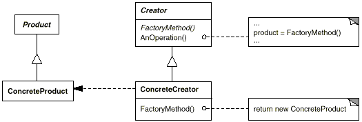

# Factory Method (Criacional)

## Intenção e Objetivo
- Definir uma interface para criar um objeto, mas deixar as subclasses decidirem que classe instanciar. O Factory method permite adiar a instanciação para as subclasses.
- Definimos uma interface para criar um objeto, mas, em vez de a fabrica ser responsavel pela criação dos objetos, a responsabilidade é passada para a subclasse, que decidirá a classe a ser instanciada
- O Factory Method é um padrão criacional de projeto que fornece uma interface para criar objetos em uma superclasse, mas permite que as subclasses alterem o tipo de objetos que serão criados.

## Tambem conhecido como
- Virtual Constructor 

## Motivação

A criação de objetos pode ser um processo complexo, que requer várias etapas específicas ou diferentes opções de inicialização. Por exemplo, um objeto pode precisar ser inicializado com dados do usuário, ou pode precisar ser criado de acordo com um conjunto de regras específicas.

O problema que o Factory Method Pattern resolve é a criação de objetos em uma aplicação que pode ser complexa e requer várias etapas específicas ou diferentes opções de inicialização. Quando a criação de objetos é incorporada diretamente na classe cliente, o código pode ficar complicado e difícil de manter. Além disso, quando a lógica de criação de objetos é repetida em vários lugares da aplicação, qualquer alteração na forma como os objetos são criados deve ser replicada em todos esses lugares, tornando a manutenção mais difícil.

## Aplicabilidade
Este padrão é recomendado quando
- Uma classe não pode antecipar a classe de objetos que devem criar.
- Uma classe quer que suas subclasses especifiquem os objetos que criam.
- Classes delegam responsabilidade para uma dentre varias subclasses auxiliares, e voce quer localizar o conhecimento de qual subclasse auxiliar que é a delegada.

## Estrutura

## Participantes
## Colaborações
## Consequencias
## Implementação
## Exemplos de codigo
## Usos conhecidos
## Padrões ralacionados 

## Fontes
- 

